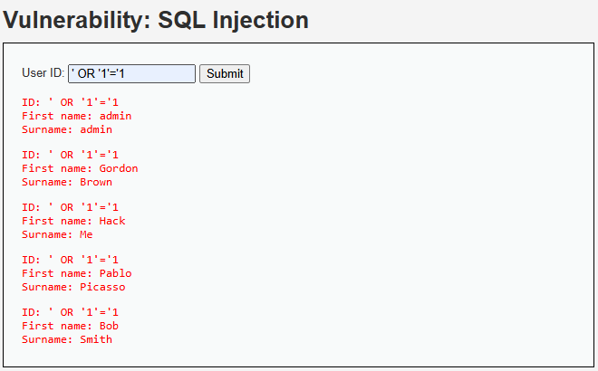

# Hallazgo 1: Inyección SQL (SQL Injection)

## 1. Evidencia del Ataque
* **Payload Utilizado:** `' OR '1'='1`
* **Imagen de Respaldo:** 

## 2. Análisis Técnico
La vulnerabilidad existe porque el backend concatena directamente la entrada del usuario en la consulta SQL sin sanitización ni parametrización previa. Al ingresar el payload, se altera la lógica booleana de la consulta (`WHERE user_id = '' OR '1'='1'`), forzando a la base de datos a retornar **todos** los registros de la tabla.

## 3. Severidad y Puntaje CVSS v3.1
* **Vector de Estado:** `CVSS:3.1/AV:N/AC:L/PR:N/UI:N/S:U/C:H/I:H/A:H`
* **Puntaje Base:** **9.8 (Crítico)**
* **Impacto en AeroAustral:** Exposición masiva de pasaportes y datos de pago. Un atacante podría vaciar la base de datos completa de los clientes de la aerolínea.

## 4. Controles Defensivos
* **Política de Prevención:** Prohibir explícitamente la concatenación de strings para construir consultas dinámicas en el código fuente.
* **Control de Mitigación:** Implementar **Consultas Parametrizadas (Prepared Statements)** a nivel de código y restringir los privilegios del usuario de la base de datos (Principio de Menor Privilegio).