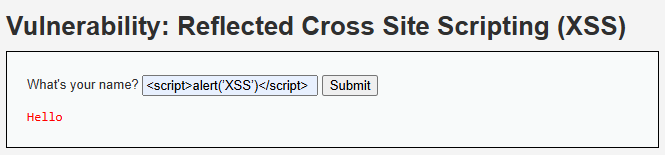

# Hallazgo 2: Cross-Site Scripting Reflejado (XSS)

## 1. Evidencia del Ataque
* **Payload Utilizado:** ``
* **Imagen de Respaldo:** 

## 2. Análisis Técnico
El portal web refleja la entrada del usuario directamente en el DOM del navegador sin aplicar codificación de caracteres (HTML Entity Encoding). Esto permite al navegador interpretar las etiquetas `<script>` como código JavaScript legítimo en el contexto de la sesión de la víctima.

## 3. Severidad y Puntaje CVSS v3.1
* **Vector de Estado:** `CVSS:3.1/AV:N/AC:L/PR:N/UI:R/S:C/C:L/I:L/A:N`
* **Puntaje Base:** **6.1 (Medio)**
* **Impacto en AeroAustral:** Secuestro de sesiones (Session Hijacking) de clientes activos. Los atacantes podrían robar tokens de autenticación o redirigir a los pasajeros a pasarelas de pago falsas (Phishing).

## 4. Controles Defensivos
* **Política de Prevención:** Sanitizar y codificar de manera obligatoria toda salida de datos que se renderice en el navegador.
* **Control de Mitigación:** Implementar una política **Content Security Policy (CSP)** estricta a través de encabezados HTTP para mitigar la ejecución de scripts no autorizados, junto con la bandera `HttpOnly` en las cookies de sesión.