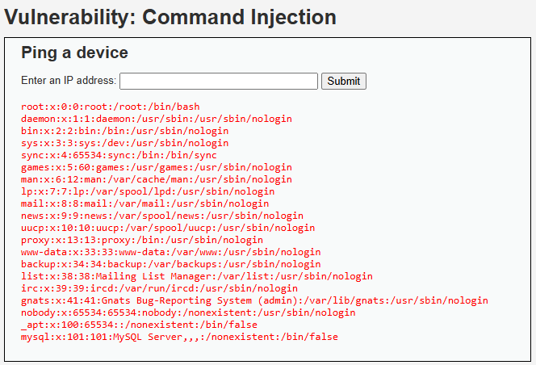

# Hallazgo 3: Inyección de Comandos (Command Injection)

## 1. Evidencia del Ataque
* **Payload Utilizado:** `127.0.0.1; cat /etc/passwd`
* **Imagen de Respaldo:** 

## 2. Análisis Técnico
La aplicación web ejecuta comandos del sistema operativo subyacente utilizando funciones del shell (como `exec()` o `system()`) combinadas directamente con la entrada de texto del usuario. El uso del punto y coma (`;`) actúa como separador, permitiendo encadenar y ejecutar comandos arbitrarios con los privilegios del servidor web.

## 3. Severidad y Puntaje CVSS v3.1
* **Vector de Estado:** `CVSS:3.1/AV:N/AC:L/PR:N/UI:N/S:C/C:H/I:H/A:H`
* **Puntaje Base:** **10.0 (Crítico)**
* **Impacto en AeroAustral:** Compromiso total de la infraestructura. El atacante toma el control del servidor, pudiendo borrar registros de vuelos, modificar bases de datos o usar el servidor como pivote para atacar la red interna de la aerolínea.

## 4. Controles Defensivos
* **Política de Prevención:** Evitar por completo el uso de funciones de sistema que invoquen comandos del sistema operativo a través del shell web.
* **Control de Mitigación:** Utilizar APIs nativas del lenguaje de programación en lugar de llamadas al sistema. Si es estrictamente necesario, implementar una lista blanca (allowlist) estricta para las entradas aceptadas.